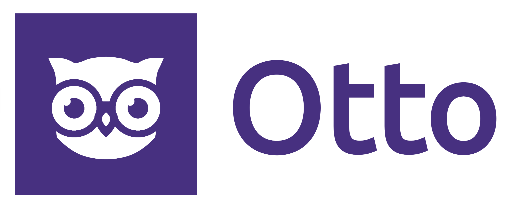

# Otto: Your friendly machine learning assistant.

## Build machine learning pipelines through natural language conversation
Otto is an intelligent chat application, designed to help aspiring machine learning engineers _go from idea to implementation with zero domain knowledge_. Our website features easy model selection, powerful visualization tools, and an intuitive natural language experience guiding you every step of the way. A collection of Wit backend apps service Otto's conversational abilities and machine learning tools throughout.

***

## Highlights

- **Beginner-friendly design.** Otto is made for novices, as it assumes no prior knowledge of machine learning. Users simply describe their end goals to obtain intelligent recommendations, or can choose from sample datasets to access optimized models in an instant.

- **Powerful machine learning tools.** A range of machine learning capabilities are supported, including models for regression, classification and natural language processing, as well as preprocessors tailored to your problem. Play with neural networks, explore data visualizations, and generate ready-made Python code right in your browser!

- **Educational experience.** Users are walked through each stage of the process and can ask Otto questions to learn more along the way. Annotated code blocks provide eager learners a high-level understanding of their end-to-end pipeline.

***

## Stages

Below is a technical description intended for those interested in a step-by-step breakdown.

### Task 

One of the biggest obstacles faced by those just getting started with ML is the abundance of jargon, from “loss functions” to “contour boundaries“ — beginners can't be expected to decide what model to use based on cryptic terminology, let alone develop one from scratch! Otto narrows down your options by inferring the high-level task at hand from a simple objective statement.

Task inference is powered by a Wit application (**Otto-Task**) trained on 300 such statements (e.g. “I want to detect loan applications as fraudulent”, “help me forecast stock prices”, or “let's summarize an article into a paragraph”) derived from real-world machine learning research. **Otto-Task** attempts to categorize the _task_ intent as regression, classification, or natural language processing, and additionally extracts a _subject_ entity embodying a streamlined form of the objective in order to filter out extraneous words. 

The subject is parsed for keyword matches (“tweets”, “housing”, etc) against our database of sample datasets. If a relevant dataset is found, Otto pulls the optimal task, model, and preprocessors for the dataset and pre-selects them for the user throughout the pipeline-building process. Otherwise, Otto issues a task recommendation based on the recognized intent. And if no intent was identified, the user is provided with some tips to help them pick the best task themselves.

### Dataset

Users are recommended a specific sample dataset matching their subject, or otherwise offered to preview and choose one themselves. Sample data allows beginners to prototype models quickly and easily, without the complexity of finding a dataset and figuring out the relevant features among dozens. Users may also opt to with their own data, which they can include later on in the generated code. 

### Model

If the user opted for custom data, Otto leverages Wit to perform the key step of selecting a classifier or regressor. A Wit app (**Otto-Model**) parses a brief user description of their data for key phrases indicating the desirability of a particular model. The app includes around 15 phrases and synonyms per model and performs fuzzy string matching, making it an effective and scalable technique for model recommendation.

A characterization of the classification dataset as “simple” or having “just a few columns”, would make the K-Nearest Neighbors algorithm a good choice, while a description of the regression data as “crime rates” or “annual consumer rankings” would suggest a Poisson or ordinal model, respectively. If no phrase is flagged, Otto will default to the most general model available: a Neural Network for classification, or a linear fit for regression. 

In the case of a natural language task, users can combine multiple models together for a more comprehensive analysis. Otto will recommend both sentiment analysis and entity recognition models, but provides users with information about both in case they'd like to adjust this.

### Preprocessors

What good is a fancy model if it takes ages to train? In this step, Otto swoops in with handpicked preprocessors for the user's data and model selections, abstracting away the intricacies of feature engineering and dimensionality reduction. As always, users can override the recommendations.

### Visualization

